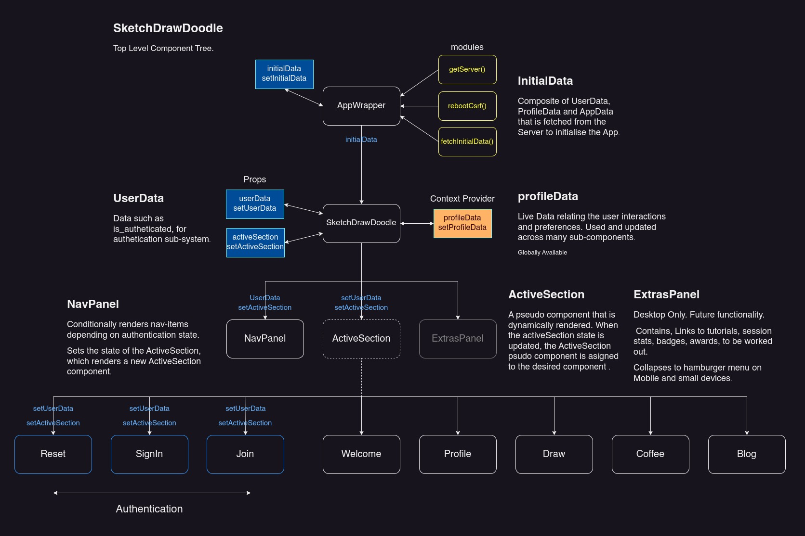
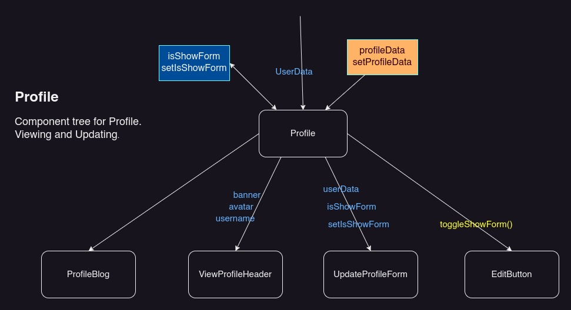
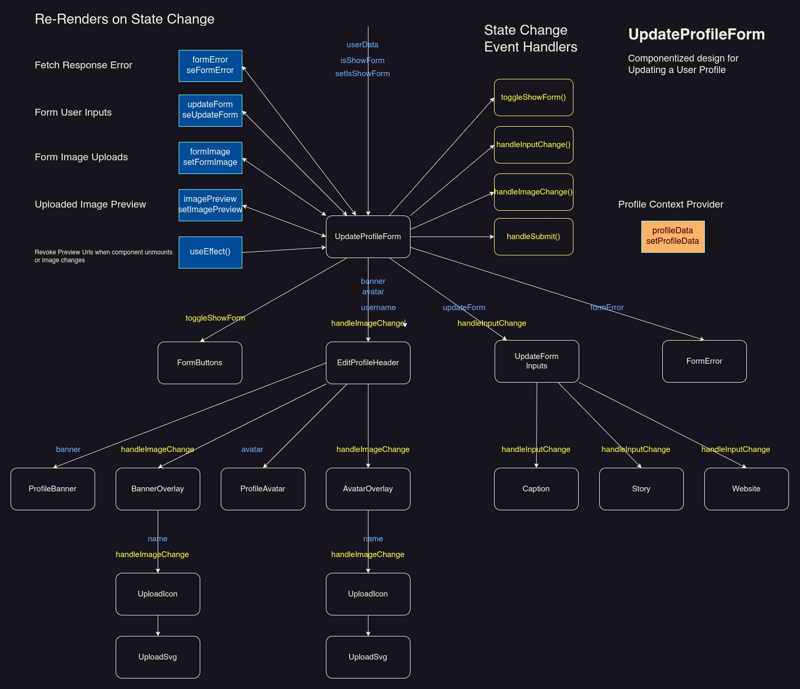

# SketchDrawDoodle User Interface and Client
ShetchDrawDoodle is an app which provides open source CC0 and royalty free images to artists along with configurable practice sessions. The app is free and available to anyone and allows them to select a category of pictures they'd like to draw and configure a practice session. A set of images that match the filter is then prepared for the practice session.

## UI Design  
The look and feel of the user interface was sketched out using Figma and implemented in SCSS. The app client is developed in React and designed mobile first with a three column layout. The first column contains the NavPanel allowing the user to navigate through the app, the center column contains the main app sections loaded by clicking nav links and the third column which is an extras panel and can be used for anything that comes to mind (trending categories, tutorials, hints&tips, promotions). The details of the Extras Panel will be worked out and implemented after the core functionality is in place.

  
The design is responsive.  
On Desktop the NavPanel expands to allow space for descriptive labels for links but shrinks down on mobile only showing icons

The main sections panel maintains the majority of the screen space adapting to fill as much space as possible

The ExtrasPanel appears only on devices above 798px width, disappearing entirely on smaller devices and mobile. When collapsed its content can be accessed through a hamburger menu.

## Initialization  #
When the app first loads, it unpacks a JSon payload in the DOM from the Django Server containing data on the initial state of the app. The top level component SketchDrawDoodle then initializes the app state, such as whether the user is signed in and what app section to initially render

## NavPanel  
Each link in the nav panel is a React component containing a label and an SVG. I decided to create SVG's(In Inkscape) to allow maximum flexibility in styling and because they have a small file size and scale well. 

The links are described in an array, making it easy to modify existing links or add new ones.The links that a user sees depends on whether they're signed in, so are conditionally rendered based on their linkType property. The array is then iterated over, mapping the link objects into their corrosponding Link component. 

## Managing App Sections
SketchDrawDoodle has a number of sections that will appear in the main panel area as the user interacts with the app. The activeSection is initialized when the app is first rendered and the state managed in the top level SketchDrawDoodle component where it is the single source of truth. Child components are passed state and are able to modify the activeSecion when various events occur.

A similar declarative design is used for managing the sections, where each section is described as an object within an array. The active section can then be found in the array and its corrosponding component loaded.  

A short blog on the initialization process can be seen here:
[SketchDrawDoodle Initialization](https://rumble.com/v6yhu7u-sketchdrawdoodle-initialisation.html)  

## Authentication  
Authentication is managed by the Django API which tells the Client whether a user is signed in or not and manages session and csrf. This then determines which features of the app are available, for example the profile is only available to registered users.  

The standard user authtication framework is implemented, Signin, Join(two step verification by email), Reset Password(three step verification), Singout. SImple Client side validation is made before form submission with more extensive form validation carried out on the server. Validation errors or success is returned and the user is either signed in, signed out or given an error and asked to correct and resubmit.

## Profile Management    
When a user creates a new account they are also given a profile which they can use to post their blogs and pictures. In typical social media fashion they're able to customize their profile by uploading avatars, banners , their latest SketchDrawDoodle and so on. The Profile section is a mini social network feature and may be extended to include other things like following, liking and commenting once core functionality is implemented.
  

## Updating Profile  
 This section also includes an edit function where they can update their profile whenever they want to. This is achieved by allowing users to upload or enter new files and data by form. The users profile data is sent to the server where is it validated and managed by the Django database. 
   

